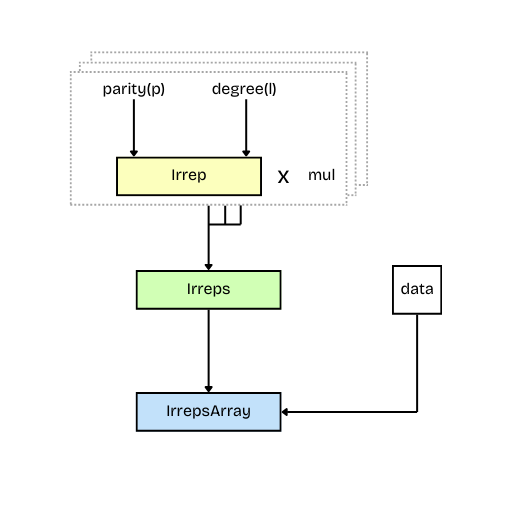

# Irreducible Representations of O(3)

A group representation $(D, V)$ describes the action of a group $G$ on a vector space $V$. Formally, this is written as:

```math
D: G \to \text{GL}(V)
```

where $\text{GL}(V)$ denotes the general linear group of $V$, i.e., the group of invertible linear transformations on $V$.

A representation of a group is a mapping(a literal matrix) from the group elements to the general linear group of matrices.
The irreducible representations, or _irreps_, are the "minimal" non-trivial representations of a group.
They are fundamental in the sense that any finite-dimensional representation of a group can be decomposed into a direct sum of irreps.

The orthogonal group $O(3)$ is the group of $3×3$ orthogonal matrices.
Geometrically, $O(3)$ represents all rotations and reflections in three-dimensional space that preserve distances and angles.
Any physical quantity, under the action of $O(3)$, transforms with a representation of $O(3)$

The special orthogonal group $SO(3)$ is a subgroup of $O(3)$. $SO(3)$ represents all rotations in three-dimensional space, excluding reflections.
$O(3)$ can be therefore be decomposed as a direct product of $SO(3)$ and the inversion group ${e, I}$:

$O(3) \cong SO(3) \times \{e, I\}$

where $e$ is the identity element of the group(here $3 \times 3$ identity matrix) and $I$ represents inversion(reflection) ($-1 \times$ identity matrix).

So, any element $g \in O(3)$ can be uniquely written as $g = ri$, where $r \in SO(3)$ and $i \in {e, I}$.

The irreps of $O(3)$ are the product of the irreps of $SO(3)$ and inversion.
The irreps of the $SO(3)$ group are called [Wigner matrices](https://en.wikipedia.org/wiki/Wigner_D-matrix) $D^L$.
The Inversion group has 2 irreps:

- The trivial representation $\sigma_+$, where inversion does nothing (multiplies by 1)
- The sign representation $\sigma_-$, where inversion flips the sign (multiplies by -1).

```math
\sigma_p(g) = \left \{ \begin{array}{l} 1 \text{ if } g = e \\ p \text{ if } g = I \end{array} \right..
```

Therefore, the irreps of an element $g \in O(3)$, where $g = ri$ is given by, $\sigma_p(i)D^L(r)$. In our library, we represent it using [$Irrep$](@ref).

And, [`Irreps`] represents the direct sum of irreps of $O(3)$:

```math
g = r i \mapsto \bigoplus_{j=1}^n m_j \sigma_{p_j}(i) D^{L_j}(r)
```

where $n \in \mathbb{N}$, $m_j \in \mathbb{N}$, $p_j \in \{+1, -1\}$, and $L_j \in \mathbb{N}_0$ for $j = 1, \ldots, n$.



## Irrep

The [`Irrep`](@ref) struct stores the degree $l$ and the parity $p$ of the representation $\sigma_p(i)D^l(r)$.

For a small recap:

- The variable $l$ represents the angular momentum quantum number or degree of the irrep.
- For $l$ = 0 , the representation is scalar, for $l$ = 1, the representation is a vector. For higher $l$, the representations are tensors of increasing rank, with dimension (2$l$ + 1).
- The parity $p$ indicates whether the irrep is invariant under reflection through the origin.
- A positive parity $( p = 1 )$ means the object behaves symmetrically under inversion, while negative parity $( p = -1 )$ implies antisymmetry, flipping sign upon inversion.
  Together, $l$ and $p$ fully characterize how a function or field transforms under both rotation and inversion.

```jldoctest
julia> using E3NN.o3

julia> Irrep("1e")
1e

julia> Irrep(1, -1)
1o

```

Get the dimension of the representaion.

```jldoctest
julia> dim(Irrep("1e"))
3
```
